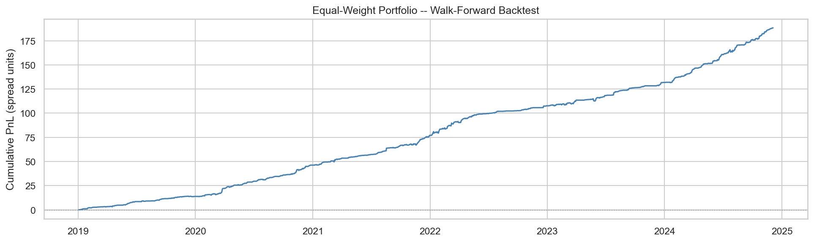
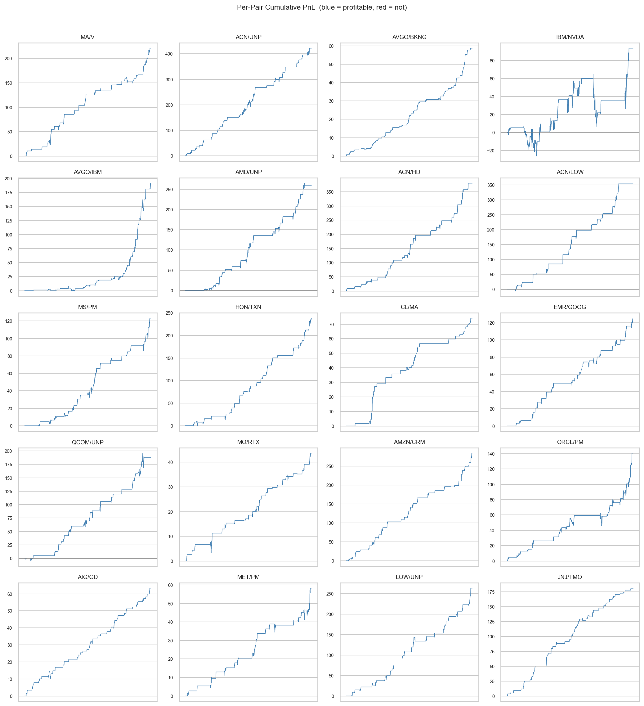

# Statistical Arbitrage

Walk-forward pairs trading strategy on S&P 100 equities, using Kalman filter spread estimation and Ornstein-Uhlenbeck signal generation.

---

## Methodology

### Pair Selection

Candidate pairs are selected from the S&P 100 universe using the Engle-Granger cointegration test (Gatev et al., 2006). All unique ticker combinations are tested at a 5% significance level and ranked by p-value. The top 20 cointegrated pairs are retained for modelling.

### Spread Modelling

Rather than a fixed OLS hedge ratio, each pair's hedge ratio is estimated dynamically via a Kalman filter (state-space model with a random-walk state equation). This allows the relationship between the two legs to drift over time without re-fitting a static regression. The spread is defined as S_t = P_A(t) - beta_t * P_B(t). Spread stationarity is confirmed by calibrating an Ornstein-Uhlenbeck (OU) process to the residuals via AR(1) OLS; the estimated mean-reversion half-life is used to screen out pairs that revert too slowly to be tradeable.

### Signal Generation

A z-scored spread is computed using a rolling 252-day window. A simple state machine generates position labels (+1 long, -1 short, 0 flat) based on three thresholds: entry (|z| > 2.0), exit (|z| < 0.5 toward zero), and stop-loss (|z| > 3.5 away from entry). Transaction costs of 5 bps one-way are deducted on every position change.

### Walk-Forward Backtesting

To avoid in-sample overfitting, the strategy is evaluated using a rolling walk-forward scheme: a 252-day formation window calibrates the Kalman filter and z-score normalisation parameters, followed by a 63-day out-of-sample trading window. The window rolls forward 21 days at a time, producing roughly 70 non-overlapping test windows over a 7-year dataset (2018-2024). The Kalman filter state carries forward across windows; only the z-score mean and standard deviation are re-estimated each formation period. Per-pair results are aggregated into an equal-weight portfolio.

---

## Results

**Portfolio equity curve** -- cumulative PnL of the equal-weight portfolio over the out-of-sample period:




**Per-pair breakdown** -- each panel shows cumulative PnL for one pair (blue = net positive, red = net negative):



---

## Project Structure

```
statistical_arbitrage/
|-- config/
|   `-- params.yaml            # all tunable parameters
|-- data/                      # cached price CSVs (gitignored)
|-- imgs/                      # saved figures for README
|-- notebooks/
|   |-- data_processing.ipynb  # 01: data loading and cleaning
|   |-- spread_modelling.ipynb # 02/03: pair selection and OU calibration
|   |-- backtest_results.ipynb # 04: walk-forward backtest + equity curves
|   `-- analysis.ipynb         # 05: drawdown, rolling Sharpe, trade stats
|-- src/
|   |-- data/
|   |   `-- loader.py          # download, cache, clean prices
|   |-- pairs/
|   |   |-- selection.py       # Engle-Granger cointegration screening
|   |   `-- spread.py          # Kalman filter hedge ratio + z-score
|   |-- models/
|   |   `-- ou_process.py      # OU calibration and optimal thresholds
|   |-- strategy/
|   |   |-- signals.py         # z-score state machine -> position labels
|   |   `-- backtest.py        # single-pair and portfolio backtesting
|   `-- analysis/
|       `-- performance.py     # Sharpe, drawdown, win rate, turnover
`-- tests/
    |-- test_signals.py        # unit tests: state machine correctness
    |-- test_backtest.py       # unit tests: PnL accounting, walk-forward
    `-- test_performance.py    # unit tests: metrics on known inputs
```

---

## How to Run

```bash
# 1. Create and activate a virtual environment
python -m venv venv
source venv/bin/activate          # Windows: venv\Scripts\activate

# 2. Install dependencies
pip install -r requirements.txt

# 3. Launch notebooks
jupyter notebook notebooks/

# 4. Run notebooks in order, starting with data_processing.ipynb
#    Price data is downloaded from Yahoo Finance on first run and cached to data/

# 5. Run tests
pytest tests/ -v
```

---

## Limitations

- *Look-ahead bias in pair selection*: pairs are selected using cointegration tests on the full 2018-2024 sample, then backtested on that same period. The walk-forward logic correctly avoids parameter look-ahead, but the pair universe itself was chosen with future knowledge. In a live setting, pairs would be selected inside each formation window and many would not pass the filter. This is the primary source of inflated Sharpe and profit factor; live performance would be materially lower.
- *Survivorship bias*: the universe is fixed to current S&P 100 constituents. Pairs involving tickers that were dropped from the index during 2018-2024 are excluded, which overstates the available opportunity set.
- *Transaction cost model*: a flat 5 bps one-way cost is applied. This does not account for market impact, bid-ask spread variation, or borrow costs on short legs.
- *No leverage or capital constraints*: positions are sized in spread units with notional = 1. A real implementation would need position sizing, margin limits, and risk-based allocation.
- *No slippage*: all fills are assumed at the closing price on the signal day.
- *Parameter stability*: entry/exit thresholds are fixed across all pairs and the full backtest period. A richer model would adapt them per pair using the OU half-life and account for regime changes.

---

## References

- Vidyamurthy, G. (2004). *Pairs Trading: Quantitative Methods and Analysis*. Wiley.
- Gatev, E., Goetzmann, W. N., and Rouwenhorst, K. G. (2006). Pairs trading: Performance of a relative-value arbitrage rule. *Review of Financial Studies*, 19(3), 797-827.
- Avellaneda, M., and Lee, J.-H. (2010). Statistical arbitrage in the US equities market. *Quantitative Finance*, 10(7), 761-782.
- Ornstein, L. S., and Uhlenbeck, G. E. (1930). On the theory of the Brownian motion. *Physical Review*, 36(5), 823.
